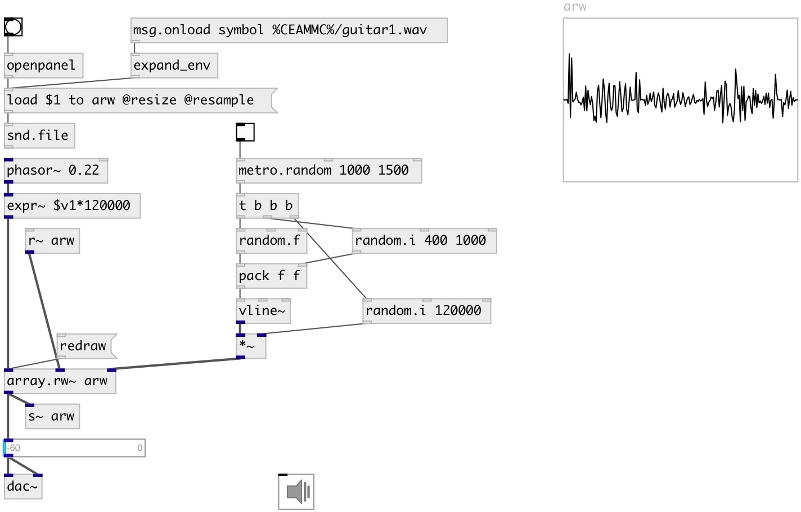

[index](index.html) :: [array](category_array.html)
---

# array.readwrite~
**aliases:** [array.rw\~]

###### array reader/writer

*available since version:* 0.9.7

---

## information
Performes these array operations in order: read, write, output

## arguments:

* **ARRAY**
array name 
_type:_ symbol 

## methods:

* **redraw**
redraw array 

## properties:

* **@array** 
Get/set array name 
_type:_ symbol 

* **@mix** 
Get/set mix amount between read signal and written 
_type:_ float 
_range:_ 0..1 
_default:_ 0 

## inlets:

* reading index 
_type:_ audio
* signal to write 
_type:_ audio
* write index 
_type:_ audio

## outlets:

* output 
_type:_ audio

## keywords:

[array](keywords/array.html)
[ltc](keywords/ltc.html)
[play](keywords/play.html)

**Authors:** Serge Poltavsky

**License:** GPL3 or later

