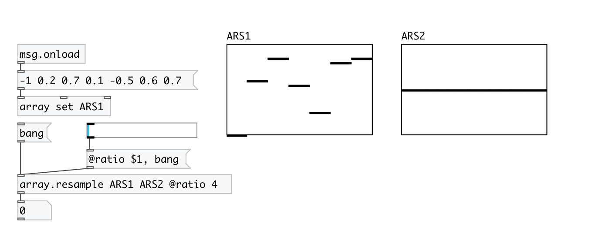

[< reference home](index.html)
---

# array.resample

array resampler

---

 

---

---
arguments:

SRC: source array 
DEST: destination array 

---
properties:

@src: source array 
@dest: destination array 
@ratio: resample ratio
            (src/dest) 
@quality: resample quality 
@high: alias to @quality high 
@fast: alias to @quality fast 
@low: alias to @quality low 
@medium: alias to @quality medium 
@best: alias to @quality best 

