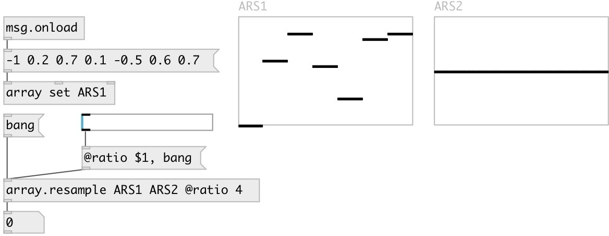

[index](index.html) :: [array](category_array.html)
---

# array.resample

###### array resampler

*available since version:* 0.9

---

## arguments:

* **SRC**
source array 
__type:__ symbol 

* **DEST**
destination array 
__type:__ symbol 

## properties:

* **@src** 
Get/set source array 
__type:__ symbol 

* **@dest** 
Get/set destination array 
__type:__ symbol 

* **@ratio** 
Get/set resample ratio (src/dest) 
__type:__ float 
__min value:__ 0 
__default:__ 0 

* **@quality** 
Get/set resample quality 
__type:__ symbol 
__enum:__ high, fast, low, medium, best 
__default:__ high 

* **@high** 
Get/set alias to @quality high 
__type:__ alias 

* **@fast** 
Get/set alias to @quality fast 
__type:__ alias 

* **@low** 
Get/set alias to @quality low 
__type:__ alias 

* **@medium** 
Get/set alias to @quality medium 
__type:__ alias 

* **@best** 
Get/set alias to @quality best 
__type:__ alias 

## inlets:

* starts resampling 
__type:__ control 

## outlets:

* number of samples written
__type:__ control 

## keywords:

[array](keywords/array.html)
[resample](keywords/resample.html)

**Authors:** Serge Poltavsky

**License:** GPL3 or later

