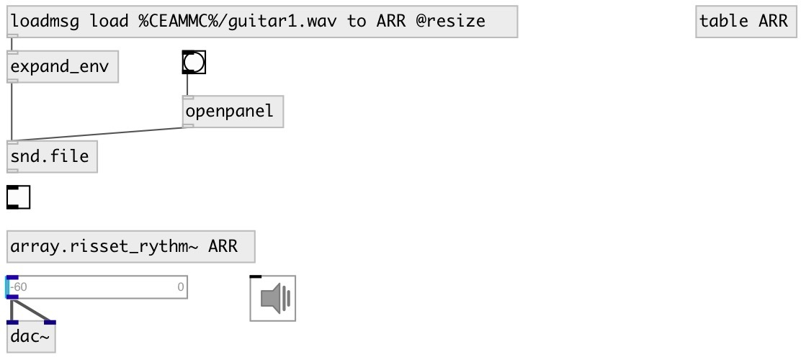

[index](index.html) :: [array](category_array.html)
---

# array.risset_rythm~

###### Risset Rhythm: accelerando or ritardando

*available since version:* 0.9.5

---

## information
not finished yet

## inlets:

* change array name 
_type:_ control

## outlets:

* output signal 
_type:_ control

## keywords:

[array](keywords/array.html)
[risset](keywords/risset.html)
[rhythm](keywords/rhythm.html)

**Authors:** Serge Poltavsky

**License:** GPL3 or later

