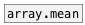
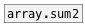

[< reference home](ceammc_lib.html)
---

# array.rms


calculates root mean square value for array

---

<br>


---


```


[B]                       [array arms size=300 w=300 h=100]
|
[array.rms arms]
|
[F digits=16]


[uniform( [sin 100( [gauss 0 0.3( [fill 0( [pulse 50( [tri 60(
|         |         |             |        |          |
|         |         |             |        |          |
|         |         |             |        |          |
[array.fill                                       arms]

            
```

---
arguments:

NAME: array name<br>

---
properties:

@array: array name<br>

---
see also:<br>
[](array.mean.html)
[](array.sum2.html)
