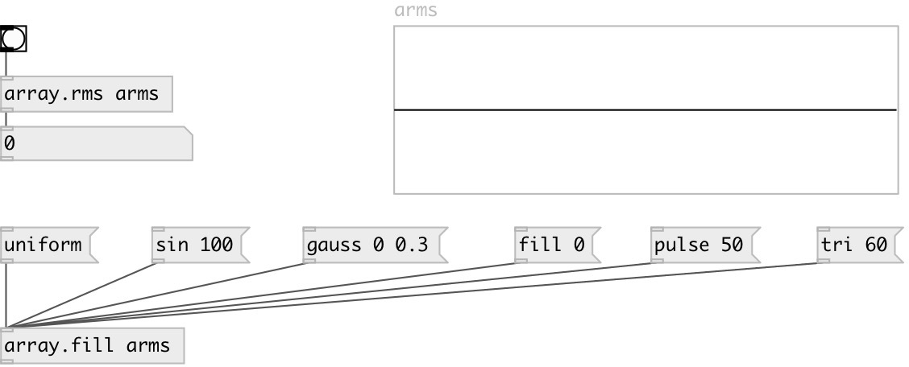

[index](index.html) :: [array](category_array.html)
---

# array.rms

###### calculates root mean square value for array

*available since version:* 0.7.1

---

## arguments:

* **NAME**
array name 
_type:_ symbol 

## properties:

* **@array** 
Get/set array name 
_type:_ symbol 

## inlets:

* calculates and outputs RMS value 
_type:_ control

## outlets:

* RMS value 
_type:_ control

## keywords:

[array](keywords/array.html)
[mean](keywords/mean.html)
[rms](keywords/rms.html)
[square](keywords/square.html)

**See also:**
[\[array.mean\]](array.mean.html)
[\[array.sum2\]](array.sum2.html)

**Authors:** Serge Poltavsky

**License:** GPL3 or later

