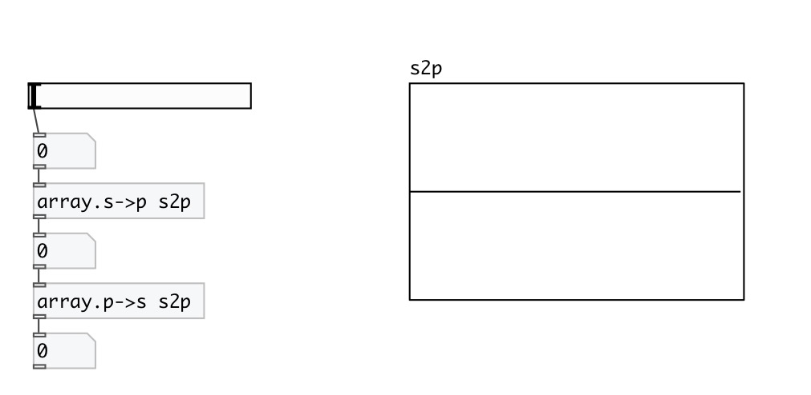

[index](index.html) :: [conv](category_conv.html)
---

# array.s2p

###### convert sample position to phase range [0..1]

*available since version:* 0.2

---

## information
with this object you can get relative position in array

## arguments:

* **NAME**
array name 
__type:__ symbol 

## properties:

* **@array** 
Get/set array name 
__type:__ symbol 

## inlets:

* array sample number 
__type:__ control 

## outlets:

* relative position (non-clipped)
__type:__ control 

## keywords:

[array](keywords/array.html)
[phase](keywords/phase.html)
[sample](keywords/sample.html)

**See also:**
[\[array.p2s\]](array.p2s.html)

**Authors:** Serge Poltavsky

**License:** GPL3 or later

