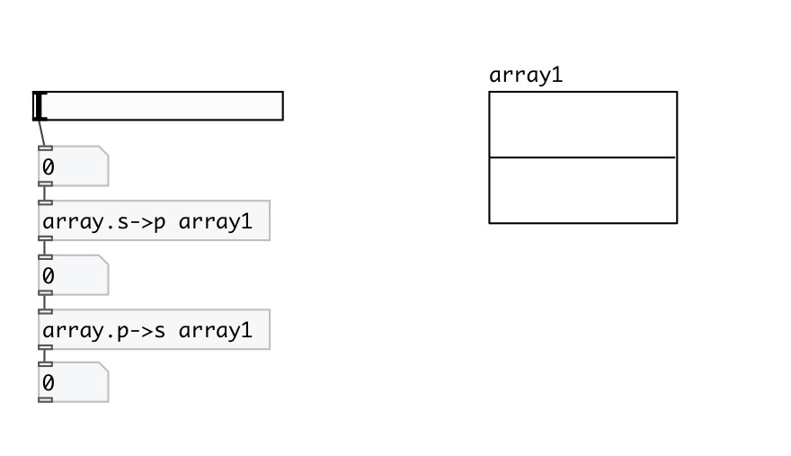

[< reference home](index.html)
---

# array.s2p

convert array sample position to relative phase position
            [0..1]

---

with this object you can get relative position in array
 

---

---
arguments:

NAME: array name 

---
properties:

@array: array name 

---
see also: 

