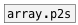

[< reference home](ceammc_lib.html)
---

# array.s2p


convert array sample position to relative phase position
            [0..1]

---

with this object you can get relative position in array
<br>


---


```


[HS min=0 max=100]       [array array1 size=100 w=100 h=70]
|
[F]
|
[array.s->p array1]
|
[F]
|
[array.p->s array1]
|
[F]

            
```

---
arguments:

NAME: array name<br>

---
properties:

@array: array name<br>

---
see also:<br>
[](array.p2s.html)
