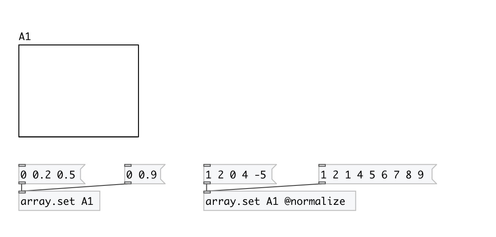

[< reference home](index.html)
---

# array.set

set array content from list

---

 

---

---
arguments:

NAME: array name 

---
properties:

@array: array name 
@normalize: scale input values to fit them in [0, 1]
            range 
@redraw: redraw array view 

---
see also: 

