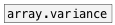

[< reference home](ceammc_lib.html)
---

# array.stddev


calculates standard deviation for array values

```


[B]                            [array astddev size=200 w=200 h=100]
|
[array.stddev astddev]
|
[F digits=16]


[gauss 0 0.4( [sin 25 1( [fill 0(
|             |          |
[array.fill       astddev]

            
```

---
arguments:

NAME: array name<br>

---
properties:

@array: array name<br>

---
see also:<br>
[](array.variance.html)
