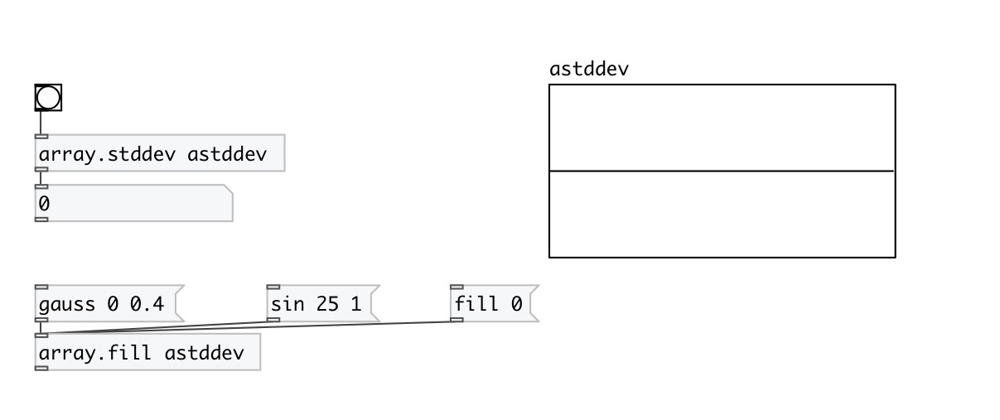

[< reference home](index.html)
---

# array.stddev

calculates standard deviation for array values

---

 

---

---
arguments:

NAME: array name 

---
properties:

@array: array name 

---
see also: 

