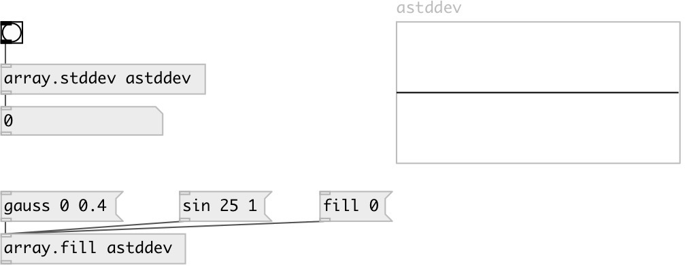

[index](index.html) :: [array](category_array.html)
---

# array.stddev

###### calculates standard deviation for array values

*available since version:* 0.7.1

---

## arguments:

* **NAME**
array name 
__type:__ symbol 

## properties:

* **@array** 
Get/set array name 
__type:__ symbol 

## inlets:

* calculates and outputs standard deviation 
__type:__ control 

## outlets:

* standard deviation value
__type:__ control 

## keywords:

[array](keywords/array.html)
[deviation](keywords/deviation.html)

**See also:**
[\[array.variance\]](array.variance.html)

**Authors:** Serge Poltavsky

**License:** GPL3 or later

