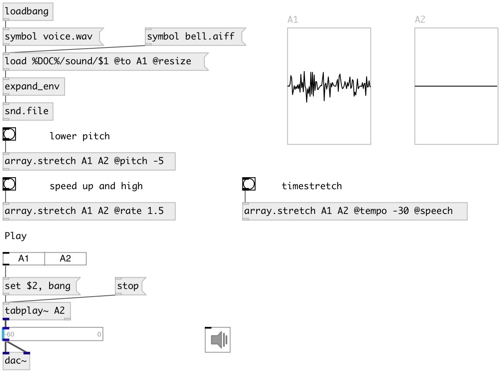

[index](index.html) :: [array](category_array.html)
---

# array.stretch

###### array time-stretch, pitch-shift or rate-change

*available since version:* 0.4

---

## information
Based on SoundTouch library for changing the Tempo, Pitch and Playback Rates of arrays. Copies time-stretched data from source to destination array

## arguments:

* **SRC**
source array 
_type:_ symbol 

* **DEST**
destination array 
_type:_ symbol 

## properties:

* **@src** 
Get/set source array 
_type:_ symbol 

* **@dest** 
Get/set destination array 
_type:_ symbol 

* **@tempo** 
Get/set relative tempo change without affecting the sound pitch 
_type:_ float 
_units:_ % 
_range:_ -50..100 
_default:_ 0 

* **@pitch** 
Get/set relative pitch change while keeping the original tempo 
_type:_ float 
_units:_ semitone 
_default:_ 0 

* **@rate** 
Get/set playback rate - changes both tempo and pitch together as if a vinyl disc was
played at different RPM rate 
_type:_ float 
_range:_ 0.1..2 
_default:_ 1 

* **@speech** 
Get/set optimize for speech sound source 
_type:_ bool 

* **@antialias** 
Get/set use of anti-alias filter. Anti-alias filter is used to prevent folding of high
frequencies when transposing the sample rate with interpolation. 
_type:_ bool 
_default:_ 0 

* **@aalength** 
Get/set pitch transposer anti-alias filter length 
_type:_ int 
_range:_ 8..128 
_default:_ 64 

* **@sequence** 
Get/set Default length of a single processing sequence, in milliseconds. This
determines to how long sequences the original sound is chopped in the time-
stretch algorithm. The larger this value is, the lesser sequences are used in
processing. In principle a bigger value sounds better when slowing down tempo,
but worse when increasing tempo and vice versa. Increasing this value reduces
computational burden &amp; vice versa. Giving *0* value for the sequence length
sets automatic parameter value according to tempo setting (recommended). 
_type:_ int 
_units:_ ms 
_range:_ 0..100 
_default:_ 0 

* **@seekwindow** 
Get/set Seeking window default length in milliseconds for algorithm that finds the best
possible overlapping location. This determines from how wide window the
algorithm may look for an optimal joining location when mixing the sound
sequences back together. The bigger this window setting is, the higher the
possibility to find a better mixing position will become, but at the same time
large values may cause a &#34;drifting&#34; artifact because consequent sequences will
be taken at more uneven intervals. If there&#39;s a disturbing artifact that sounds
as if a constant frequency was drifting around, try reducing this setting.
Increasing this value increases computational burden &amp; vice versa. Giving *0*
value for the seek window length sets automatic parameter value according to
tempo setting (recommended) 
_type:_ int 
_units:_ ms 
_range:_ 0..100 
_default:_ 0 

* **@overlap** 
Get/set Overlap length in milliseconds. When the chopped sound sequences are mixed back
together, to form a continuous sound stream, this parameter defines over how
long period the two consecutive sequences are let to overlap each other.
Increasing this value increases computational burden &amp; vice versa. 
_type:_ int 
_units:_ ms 
_range:_ 0..100 
_default:_ 8 

## inlets:

* starts processing 
_type:_ control

## outlets:

* float value - number of result samples 
_type:_ control

## keywords:

[array](keywords/array.html)
[stretch](keywords/stretch.html)

**Authors:** Olli Parviainen, Serge Poltavsky

**License:** GPL3 or later

