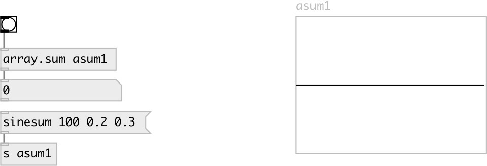

[index](index.html) :: [array](category_array.html)
---

# array.sum

###### calculates sum of array elements

*available since version:* 0.8

---

## arguments:

* **NAME**
array name 
__type:__ symbol 

## properties:

* **@array** 
Get/set array name 
__type:__ symbol 

## inlets:

* calculates and outputs the sum 
__type:__ control 

## outlets:

* sum of array values
__type:__ control 

## keywords:

[array](keywords/array.html)
[sum](keywords/sum.html)

**See also:**
[\[array.sum2\]](array.sum2.html)

**Authors:** Serge Poltavsky

**License:** GPL3 or later

