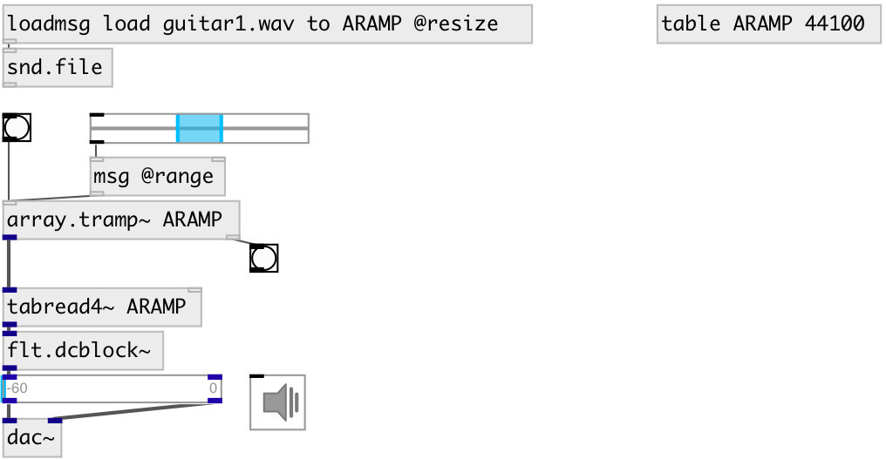

[index](index.html) :: [array](category_array.html)
---

# array.tramp~

###### triggered ramp generator for array

*available since version:* 0.9.7

---

## arguments:

* **ARRAY**
array name 
_type:_ symbol 

* **SPEED**
playing speed 
_type:_ float 

## properties:

* **@array** 
Get/set array name 
_type:_ symbol 

* **@speed** 
Get/set ramp speed 
_type:_ float 
_default:_ 1 

* **@from** 
Get/set normalized to [0-1] range ramp start 
_type:_ float 
_range:_ 0..1 
_default:_ 0 

* **@to** 
Get/set normalized to [0-1] range ramp end 
_type:_ float 
_range:_ 0..1 
_default:_ 1 

* **@range** 
Get/set ramp range 
_type:_ list 
_default:_ 0 1 

## inlets:

* start ramp for array 
_type:_ control

## outlets:

* ramp signal 
_type:_ audio
* bang on done 
_type:_ control

## keywords:

[array](keywords/array.html)
[ramp](keywords/ramp.html)
[trigger](keywords/trigger.html)

**Authors:** Serge Poltavsky

**License:** GPL3 or later

