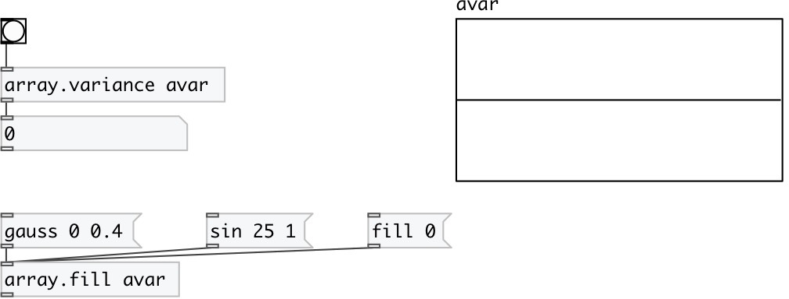

[index](index.html) :: [array](category_array.html)
---

# array.variance

###### calculates variance of array values

*available since version:* 0.7.1

---

## arguments:

* **ARRAY**
array name 
_type:_ symbol 

## properties:

* **@array** 
Get/set array name 
_type:_ symbol 

## inlets:

* calculates and outputs variance 
_type:_ control

## outlets:

* variance 
_type:_ control

## keywords:

[array](keywords/array.html)
[deviation](keywords/deviation.html)
[variance](keywords/variance.html)

**See also:**
[\[array.stddev\]](array.stddev.html)

**Authors:** Serge Poltavsky

**License:** GPL3 or later

