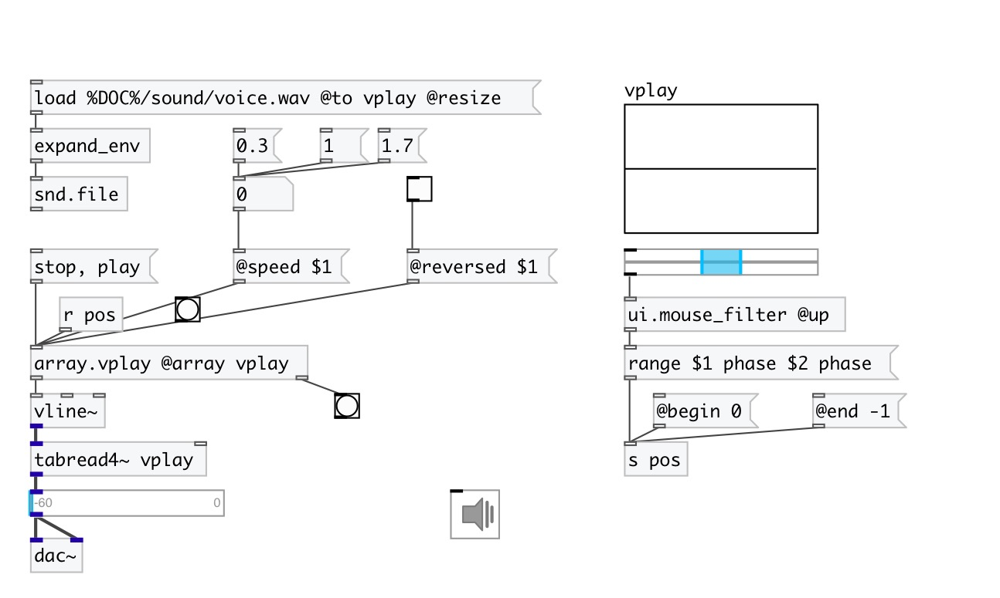

[index](index.html) :: [array](category_array.html)
---

# array.vplay

###### simple array player for using with vline~

*available since version:* 0.5

---

## arguments:

* **NAME**
array name 
_type:_ symbol 

## methods:

* **play**
start playing 

* **stop**
stop playing 

* **range**
set play range. 
  __parameters:__
  - **VALUE** start value. Negative values (offset from end) are supported for ms, sec and sample units. *-1 sample* means last sample. 
    type: float  
    required: True  

  - **UNIT** value unit 
    type: symbol  
    required: True  

  - **[VALUE]** end value 
    type: float  

  - **UNIT** value unit 
    type: symbol  
    required: True  

## properties:

* **@array** 
Get/set array name 
_type:_ symbol 

* **@state** (readonly)
Get player state 
_type:_ symbol 
_enum:_ play, stop 
_default:_ stop 

* **@speed** 
Get/set play speed 
_type:_ float 
_min value:_ 0.1 
_default:_ 1 

* **@begin** 
Get/set begin position in samples 
_type:_ int 
_units:_ samp 
_default:_ 0 

* **@end** 
Get/set end position in samples 
_type:_ int 
_units:_ samp 
_default:_ -1 

* **@abs_begin** (readonly)
Get absolute start position in samples 
_type:_ int 
_units:_ samp 
_default:_ 0 

* **@abs_end** (readonly)
Get absolute stop position in samples 
_type:_ int 
_units:_ samp 
_default:_ 0 

* **@reversed** 
Get/set playing backwards (if set to 1) 
_type:_ int 
_enum:_ 0, 1 
_default:_ 0 

## inlets:

* start playing from the begining 
_type:_ control

## outlets:

* message to vline~ object 
_type:_ control
* bang after playing finished 
_type:_ control

## keywords:

[array](keywords/array.html)
[play](keywords/play.html)
[vline](keywords/vline.html)

**See also:**
[\[list.each\]](list.each.html)

**Authors:** Serge Poltavsky

**License:** GPL3 or later

