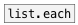

[<<< reference home](ceammc_lib.md)
---

# array.vplay

```


[load %DOC%/sound/voice.wav @to vplay @resize(
|                                        [array vplay size=100 w=120 h=80]
[expand_env]  [0.3( [1( [1.7(
|             |     |   |
[snd.file]    [F        ] [T]
              |           |
              |           |
[stop, play(  [@speed $1( [@reversed $1( [ui.rslider @mouse_events 1]
|             |           |              |
| [r pos] [B] |           |              [ui.mouse_filter @up]
| |       |   |           |              |
[array.vplay @array vplay ]              [range $1 phase $2 phase(
|                    ^|                  |
[vline~]             [B]                 | [@begin 0( [@end -1(
|                                        | |          |
[tabread4~ vplay]                        [s        pos]
|
[ui.gain~ @size 120 16]      [ui.dsp~]
| \
[dac~]

            
```
---
simple array player for using with vline~
---
arguments:

NAME: array name<br>

---
properties:

@array: array name<br>
@state: 
            player state<br>
@speed: play speed<br>
@begin(samp): begin position in
            samples<br>
@end(samp): end position in
            samples<br>
@abs_begin(samp): 
            absolute start position in samples<br>
@abs_end(samp): 
            absolute stop position in samples<br>
@reversed: playing backwards (if set
            to 1)<br>

---
see also:<br>
[](list.each.md)
