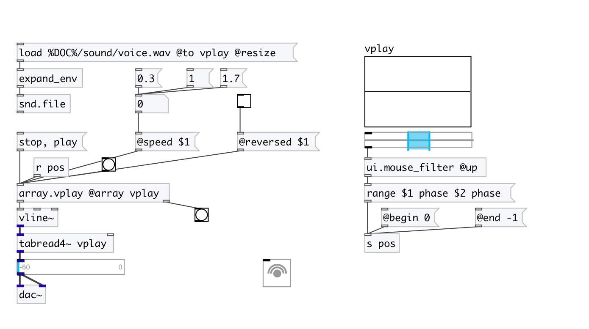

[< reference home](index.html)
---

# array.vplay

simple array player for using with vline~

---

 

---

---
arguments:

NAME: array name 

---
properties:

@array: array name 
@state: 
            player state 
@speed: play speed 
@begin(samp): begin position in
            samples 
@end(samp): end position in
            samples 
@abs_begin(samp): 
            absolute start position in samples 
@abs_end(samp): 
            absolute stop position in samples 
@reversed: playing backwards (if set
            to 1) 

---
see also: 

