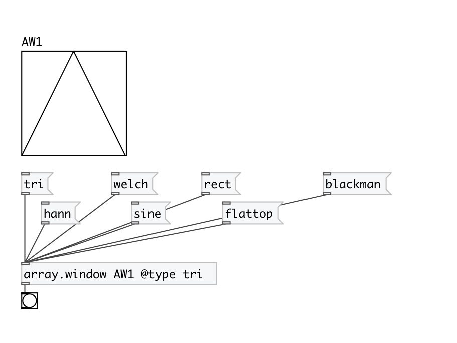
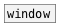

[< reference home](index.html)
---

# array.window

fill array with window

---

 

---

---
arguments:

---
properties:

@array: array name 
@redraw: redraw after array
            change 
@type: window type 

---
see also: 

