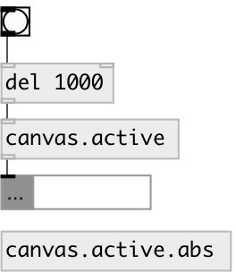

[index](index.html) :: [patch](category_patch.html)
---

# canvas.active
**aliases:** [ceammc/canvas.active]

###### checks if canvas window is on top and active

*available since version:* 0.9.6

---

## properties:

* **@abs** 
Get/set use canvas for abstractions 
_type:_ bool 
_default:_ 0 

## inlets:

* output canvas active state 
_type:_ control

## outlets:

* int: 1 or 0 
_type:_ control

## keywords:

[canvas](keywords/canvas.html)

**See also:**
[\[patch.args\]](patch.args.html)
[\[canvas.top\]](canvas.top.html)

**Authors:** Serge Poltavsky

**License:** GPL3 or later

