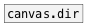

[<<< reference home](ceammc_lib.md)
---

# canvas.path

```


[B]
|
[canvas.path] [B]
|             |
[ui.display   ]

            
```
---
current canvas fullpath
---
arguments:


---
properties:


---
see also:<br>
[](canvas.name.md)
[](canvas.dir.md)
