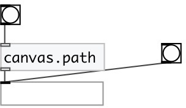

[index](index.html) :: [patch](category_patch.html)
---

# canvas.path

###### current canvas fullpath

*available since version:* 0.8

---

## inlets:

* output current canvas fullpath 
_type:_ control

## outlets:

* current canvas fullpath as symbol 
_type:_ control

## keywords:

[canvas](keywords/canvas.html)
[path](keywords/path.html)

**See also:**
[\[canvas.name\]](canvas.name.html)
[\[canvas.dir\]](canvas.dir.html)

**Authors:** Serge Poltavsky

**License:** GPL3 or later

