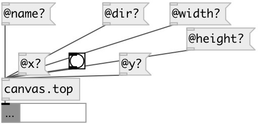

[index](index.html) :: [patch](category_patch.html)
---

# canvas.top

###### verbose information about top-level canvas

*available since version:* 0.4

---

## methods:

* **postscript**
save patch to postscript 
  __parameters:__
  - **[FNAME]** file. If not specified patch name used with .ps extension 
    type: symbol  

## properties:

* **@name** (readonly)
Get canvas name 
_type:_ symbol 
_default:_ test_canvas 

* **@dir** (readonly)
Get canvas directory 
_type:_ symbol 
_default:_ / 

* **@size** (readonly)
Get window size 
_type:_ list 
_default:_ 600 400 

* **@width** (readonly)
Get window width 
_type:_ int 
_default:_ 600 

* **@height** (readonly)
Get window height 
_type:_ int 
_default:_ 400 

* **@font** (readonly)
Get window font 
_type:_ int 
_default:_ 10 

* **@paths** (readonly)
Get search paths 
_type:_ list 

* **@x** (readonly)
Get window x-pos 
_type:_ int 
_default:_ 0 

* **@y** (readonly)
Get window y-pos 
_type:_ int 
_default:_ 0 

* **@abs** 
Get/set if false: using toplevel canvas, if true: using abstraction canvas 
_type:_ bool 
_default:_ 1 

## inlets:

* property request 
_type:_ control

## outlets:

* dict/property output 
_type:_ control

## keywords:

[canvas](keywords/canvas.html)

**See also:**
[\[patch.args\]](patch.args.html)
[\[canvas.current\]](canvas.current.html)

**Authors:** Serge Poltavsky

**License:** GPL3 or later

