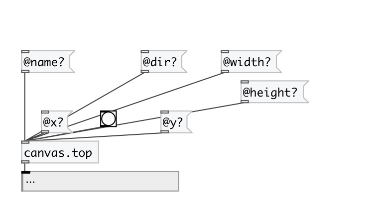

[< reference home](index.html)
---

# canvas.top

verbose information about top-level canvas

---

 

---

---
arguments:

---
properties:

@name: canvas name 
@dir: canvas directory 
@size: window size 
@width: window width 
@height: window height 
@font: window font 
@paths: search paths 
@x: window x-pos 
@y: window y-pos 

---
see also: 

