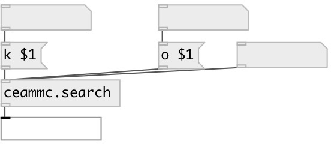

[index](index.html) :: [base](category_base.html)
---

# ceammc.search

###### ceammc library search object

*available since version:* 0.9.1

---

## methods:

* **keywords**
search in keywords 

* **k**
alias to keywords method 

* **objects**
search in objects names 

* **o**
alias to objects method 

## properties:

* **@max** 
Get/set maximum number of result 
_type:_ int 
_range:_ 1..50 
_default:_ 10 

## inlets:

* search in descriptions 
_type:_ control

## outlets:

* list of matched object names 
_type:_ control

## keywords:

[search](keywords/search.html)

**Authors:** Serge Poltavsky

**License:** GPL3 or later

