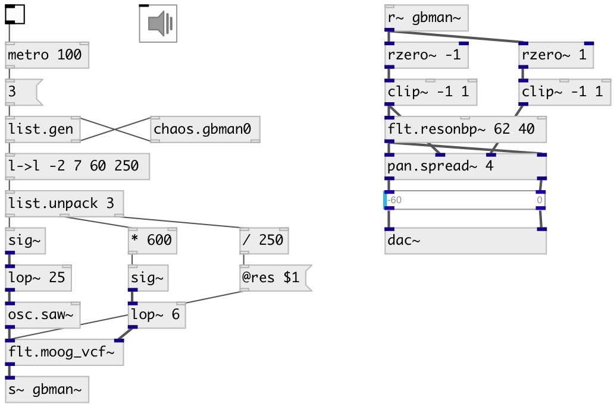

[index](index.html) :: [chaos](category_chaos.html)
---

# chaos.gbman0

###### Gingerbreadman map chaotic generator

*available since version:* 0.9

---

## information
A non-interpolating generator based on the difference equations: x(n+1) = 1 - y(n) + |x(n)| y(n+1) = x(n)

## arguments:

* **X**
initial x value, default 1.2 
_type:_ float 

* **Y**
initial y value, default 2.1 
_type:_ float 

## inlets:

* generates and outputs next x-value 
_type:_ control

## outlets:

* outputs x-value 
_type:_ control
* outputs y-value 
_type:_ control

## keywords:

[chaos](keywords/chaos.html)
[generator](keywords/generator.html)
[gingerbreadman](keywords/gingerbreadman.html)

**See also:**
[\[chaos.gbman0\]](chaos.gbman0.html)

**Authors:** Serge Poltavsky

**License:** GPL3 or later

