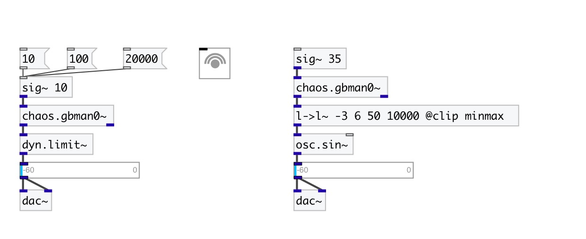

[< reference home](index.html)
---

# chaos.gbman0~

Gingerbreadman map chaotic generator

---

A non-interpolating sound generator based on the difference equations:
x(n+1) = 1 - y(n) + |x(n)|
y(n+1) = x(n)
 

---

---
arguments:

X: initial x value, default 1.2 
Y: initial y value, default 2.1 

---
properties:

---
see also: 

