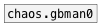

# chaos.gbman0~

```


[10( [100( [20000( [ui.dsp~] [sig~ 35]
|    |     |                 |
[sig~    10]                 [chaos.gbman0~]
|                            |
[chaos.gbman0~]              [l->l~ -3 6 50 10000 @clip minmax]
|                            |
[dyn.limit~]                 [osc.sin~]
|                            |
[ui.hgain~]                  [ui.hgain~]
|\                           |\
[dac~]                       [dac~]

            
```
---
arguments:

X: initial x value, default 1.2<br>
Y: initial y value, default 2.1<br>

---
properties:


see also:<br>

