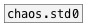

[< reference home](index.html)
---

# chaos.jong


Peter de Jong attractor

---

A non-interpolating generator based on the difference equations:
x[n+1] = sin(a * y[n]) - cos(b * x[n])
y[n+1] = sin(c * x[n]) - cos(d * y[n])
<br>


---


```


[T]                        [r~ jong]
|                          |
[metro.random 100 400]     [ui.scope~ @size=360x100]
|
[chaos.jong #a]
|
[l->l -2 2 1 2]
|
[sig~]   [l->l -2 2 -0.7 0.8 #b]
|
[lop~ 40]       [l->l -2 2 -1 1 #c]
|               |
[osc.impulse~]  [sig~]
|               |
[*~ 20]         [lop~ 5 #d]
|
[cpole~ {w=23} #z]
|        ^|.
[pan.spread~ @spread 0.4]
|                    ^|
[fx.pitchshift~ -24]  |
|                     |
[clip~ -1 1]    [clip~ -1 1]
|                    |.   |
[ui.hgain2~ @size 20 164] [s~ jong]
| ^|.
[dac~ {w=23}]
[X a:0->b]
[X a:1->c]
[X b:0->z:2]
[X d:0->z:3]

            
```

---
arguments:

A: a-value (default 1.4)<br>
B: b-value (default -2.3)<br>
C: c-value (default 2.4)<br>
D: d-value (default -2.1)<br>
X: x init value (default 0)<br>
Y: x init value (default 0)<br>

---
properties:


---
see also:<br>
[](chaos.std0.html)
