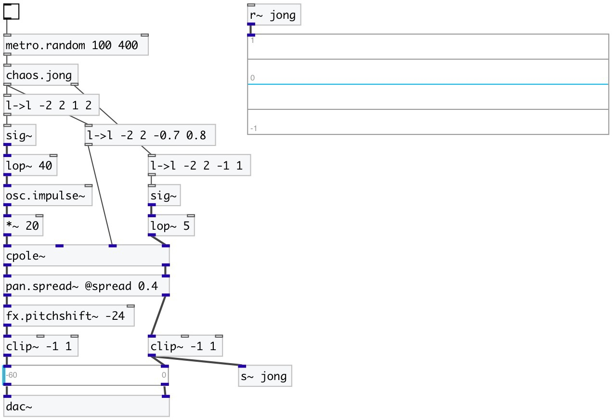

[index](index.html) :: [chaos](category_chaos.html)
---

# chaos.jong

###### Peter de Jong attractor

*available since version:* 0.9

---

## information
A non-interpolating generator based on the difference equations: x[n+1] = sin(a * y[n]) - cos(b * x[n]) y[n+1] = sin(c * x[n]) - cos(d * y[n])

## arguments:

* **A**
a-value (default 1.4) 
_type:_ float 

* **B**
b-value (default -2.3) 
_type:_ float 

* **C**
c-value (default 2.4) 
_type:_ float 

* **D**
d-value (default -2.1) 
_type:_ float 

* **X**
x init value (default 0) 
_type:_ float 

* **Y**
y init value (default 0) 
_type:_ float 

## methods:

* **reset**
set to initial state 

* **set**
set A B C D E X Y values. Also updates init state vars. 

* **a**
set a-value, does not not change init state value 

* **b**
set b-value, does not not change init state value 

* **c**
set c-value, does not not change init state value 

* **d**
set d-value, does not not change init state value 

* **x**
set current x-value, does not not change init state value 

* **y**
set current y-value, does not not change init state value 

* **om**
turn on/off method output mode. If true (1) outputs new generated value after
each a,b,d,e,x,y method call, if 0 - change values without output. Default is
0. 
  __parameters:__
  - **BOOL** output mode 
    type: int  
    required: True  

## inlets:

* generate and output new value 
_type:_ control

## outlets:

* new generated x-value 
_type:_ control
* new generated y-value 
_type:_ control

## keywords:

[chaos](keywords/chaos.html)
[peter](keywords/peter.html)
[de](keywords/de.html)
[jong](keywords/jong.html)

**See also:**
[\[chaos.std0\]](chaos.std0.html)

**Authors:** André Sier

**License:** GPL3 or later

