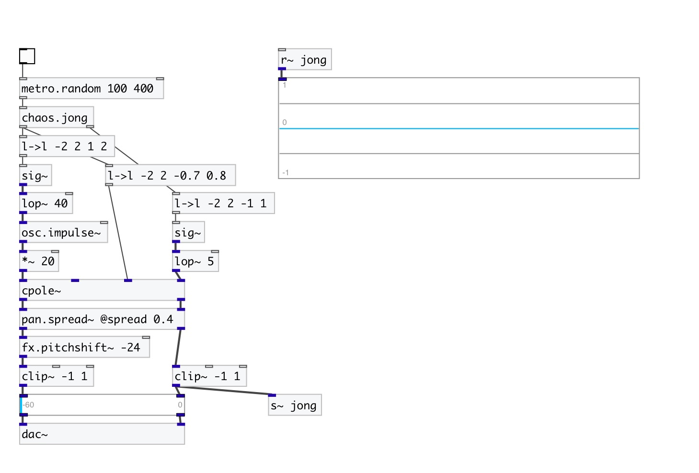

[< reference home](index.html)
---

# chaos.jong

Peter de Jong attractor

---

A non-interpolating generator based on the difference equations:
x[n+1] = sin(a * y[n]) - cos(b * x[n])
y[n+1] = sin(c * x[n]) - cos(d * y[n])
 

---

---
arguments:

A: a-value (default 1.4) 
B: b-value (default -2.3) 
C: c-value (default 2.4) 
D: d-value (default -2.1) 
X: x init value (default 0) 
Y: x init value (default 0) 

---
properties:

---
see also: 

