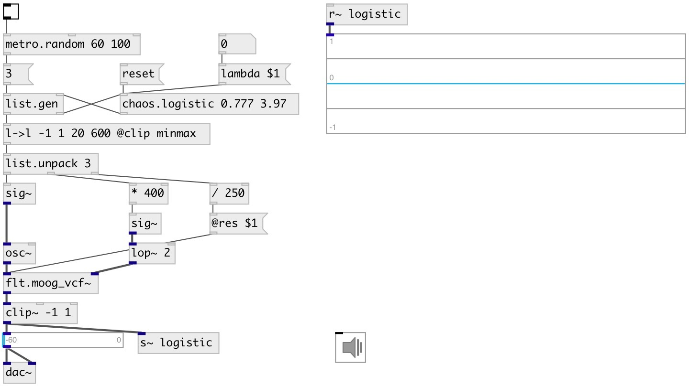

[index](index.html) :: [chaos](category_chaos.html)
---

# chaos.logistic
**aliases:** [noise.logistic]

###### Logistic map chaotic generator

*available since version:* 0.9

---

## information
A non-interpolating generator based on the difference equations: x[n+1] = λ * x[n] * (1 - x[n]) By varying the parameter λ, the following behavior is observed: • With λ between 0 and 1, the population will eventually die, independent of the initial population • With λ between 1 and 2, the population will quickly approach the value λ − 1/λ, independent of the initial population • With λ between 2 and 3, the population will also eventually approach the same value λ − 1/λ, but first will fluctuate around that value for some time. • With λ between 3 and 1 + √6 ≈ 3.44949, from almost all initial conditions the population will approach permanent oscillations between two values. These two values are dependent on λ. • With λ between 3.44949 and 3.54409 (approximately), from almost all initial conditions the population will approach permanent oscillations among four values. • With λ increasing beyond 3.54409, from almost all initial conditions the population will approach oscillations among 8 values, then 16, 32, etc. • At λ ≈ 3.56995 is the onset of chaos, at the end of the period-doubling cascade. • Most values of r beyond 3.56995 exhibit chaotic behaviour, but there are still certain isolated ranges of r that show non-chaotic behavior. Beyond λ = 4, almost all initial values eventually leave the interval [0,1] and diverge.

## arguments:

* **INIT**
x init value (default 0.777) 
_type:_ float 

* **LAMBDA**
lambda value (default 3.9) 
_type:_ float 

## methods:

* **reset**
set to initial state 

* **set**
set init value and lambda value and updates init value 

* **lambda**
set lambda value 

* **seed**
set init value, updates init value 

* **om**
set output mode. 
  __parameters:__
  - **BOOL** output mode. If 1: outputs new generated value after lambda or seed method call, if 0 - change values without output. Default is 0. 
    type: int  
    required: True  

## inlets:

* generate and output new value 
_type:_ control

## outlets:

* new generated x-value 
_type:_ control

## keywords:

[chaos](keywords/chaos.html)
[logistic](keywords/logistic.html)

**See also:**
[\[chaos.std0\]](chaos.std0.html)

**Authors:** André Sier

**License:** GPL3 or later

