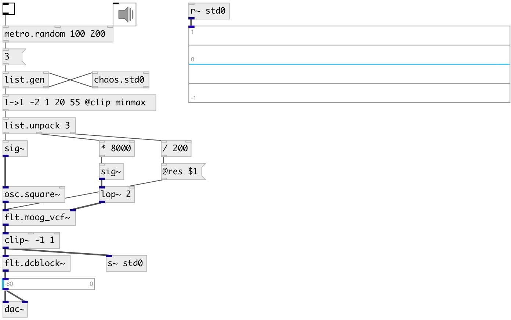

[index](index.html) :: [chaos](category_chaos.html)
---

# chaos.std0

###### Standard map chaotic generator

*available since version:* 0.9

---

## information
A non-interpolating generator based on the difference equations: y(n+1) = (y(n) + k * sin(x(n))) % 2pi x(n+1) = (x(n) + y(n+1)) % 2pi The properties of chaos of the standard map were established by Boris Chirikov in 1969

## arguments:

* **K**
k value, default 1 
_type:_ float 

* **X**
initial x value, default 0.5 
_type:_ float 

* **Y**
initial y value, default 0 
_type:_ float 

## inlets:

* generates and outputs next x-value 
_type:_ control
* set k value 
_type:_ control

## outlets:

* outputs x-value mapped to [-1..1] range 
_type:_ control
* outputs y-value mapped to [-1..1] range 
_type:_ control

## keywords:

[chaos](keywords/chaos.html)
[standard](keywords/standard.html)
[map](keywords/map.html)

**See also:**
[\[chaos.std0~\]](chaos.std0~.html)

**Authors:** Serge Poltavsky

**License:** GPL3 or later

