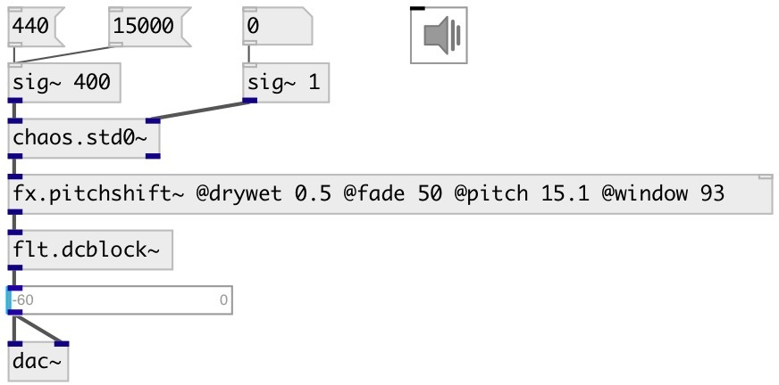

[index](index.html) :: [chaos](category_chaos.html)
---

# chaos.std0~

###### Standard map chaotic generator

*available since version:* 0.9

---

## information
A non-interpolating generator based on the difference equations:
y(n+1) = (y(n) + k * sin(x(n))) % 2pi
x(n+1) = (x(n) + y(n+1)) % 2pi
The properties of chaos of the standard map were established by Boris Chirikov in
            1969

## arguments:

* **X**
initial x value, default 0.5 
__type:__ float 

* **Y**
initial y value, default 0 
__type:__ float 

## inlets:

* generation frequency, minimal value 0.001Hz 
__type:__ audio 
* k-value 
__type:__ audio 

## outlets:

* outputs x-value mapped to [-1..1] range
__type:__ audio 
* outputs y-value mapped to [-1..1] range
__type:__ audio 

## keywords:

[chaos](keywords/chaos.html)
[standard](keywords/standard.html)
[map](keywords/map.html)

**See also:**
[\[chaos.std0\]](chaos.std0.html)

**Authors:** Serge Poltavski

**License:** GPL3 or later

