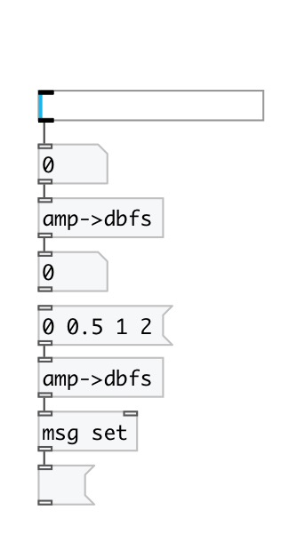

[< reference home](index.html)
---

# conv.amp2dbfs

convert from amplitude to decibel full scale

---

Note: amplitude value 0 is converted to -144 db (24-bit range)
 

---

---
arguments:

---
properties:

---
see also: 

