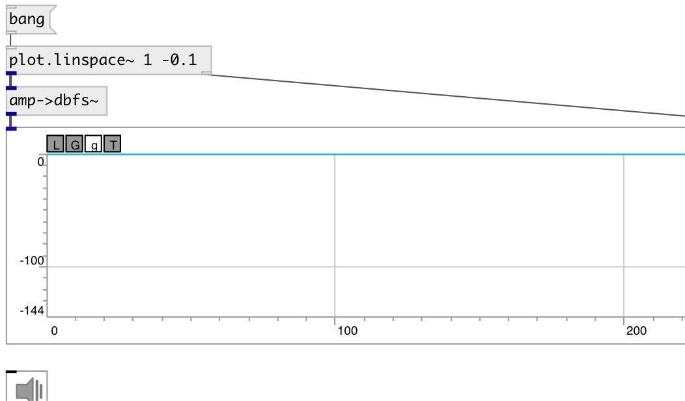

[index](index.html) :: [conv](category_conv.html)
---

# conv.amp2dbfs~

###### convert from amplitude to decibel full scale

*available since version:* 0.6

---

## information
formulae: 20 * log10(amp)
Note: amplitude value &lt;=0 is converted to -144 db (24-bit range)

## inlets:

* input signal 
__type:__ audio 

## outlets:

* converted signal
__type:__ audio 

## keywords:

[conv](keywords/conv.html)
[amp](keywords/amp.html)
[dbfs](keywords/dbfs.html)
[decibel](keywords/decibel.html)

**See also:**
[\[dbfs-&gt;amp~\]](dbfs-%3Eamp~.html)

**Authors:** Serge Poltavsky

**License:** GPL3 or later

