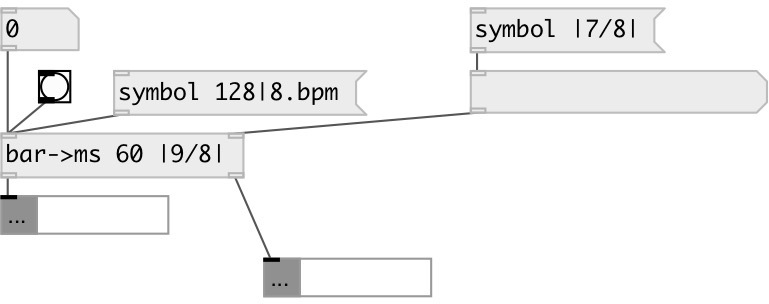

[index](index.html) :: [conv](category_conv.html)
---

# conv.bar2ms
**aliases:** [ceammc/bar-&gt;ms], [bar-&gt;ms]

###### calculate bar and beat duration

*available since version:* 0.9.7

---

## information
Example tempo values: 60, 120bpm, 90|4bpm, 80|3/8bpm Example time signature values: |3/8|, |1/4+3/16|

## arguments:

* **BPM**
init tempo BPM value 
_type:_ symbol 
_units:_ bpm 

* **TSIG**
init time signature value 
_type:_ symbol 

## properties:

* **@bpm** 
Get/set tempo bpm value 
_type:_ symbol 
_units:_ bpm 
_default:_ 60|4bpm 

* **@tsig** 
Get/set time signature value 
_type:_ symbol 
_default:_ |4/4| 

## inlets:

* output bar and beat duration 
_type:_ control
* set time signature 
_type:_ control

## outlets:

* bar period in milliseconds 
_type:_ control
* beat period in milliseconds 
_type:_ control

## keywords:

[conv](keywords/conv.html)
[time](keywords/time.html)
[duration](keywords/duration.html)
[tempo](keywords/tempo.html)
[bpm](keywords/bpm.html)

**See also:**
[\[conv.bpm2ms\]](conv.bpm2ms.html)

**Authors:** Serge Poltavsky

**License:** GPL3 or later

