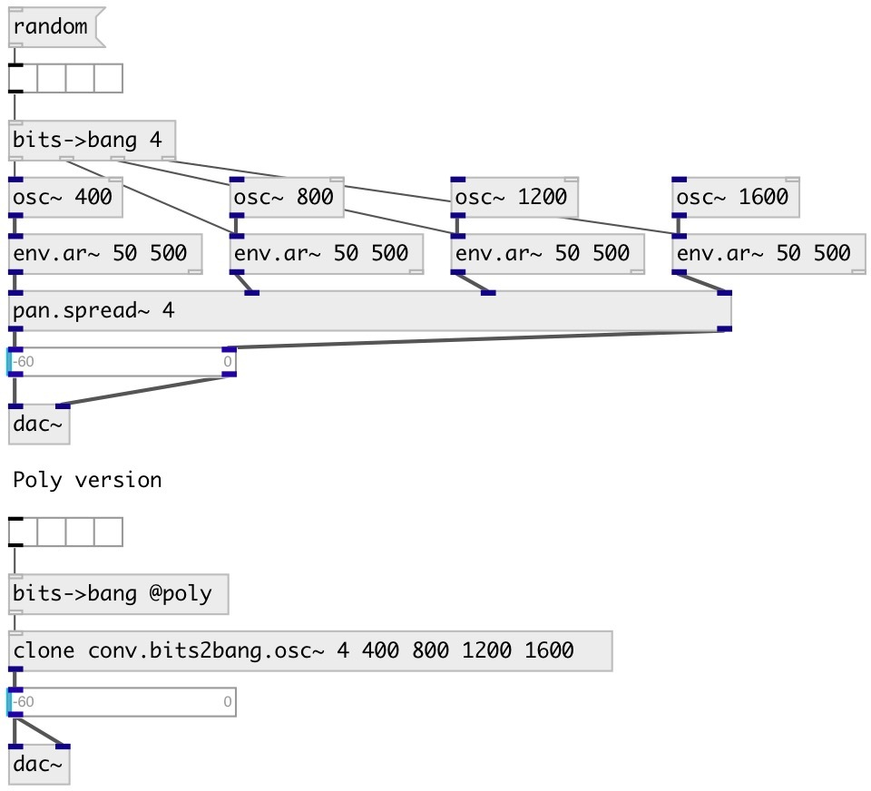

[index](index.html) :: [conv](category_conv.html)
---

# conv.bits2bang

###### convert list of bits to bang events

*available since version:* 0.9.2

---

## information
in default mode if bit is on - sends bang to corresponding outlet
in @poly mode if bit is on - send list (BIT_IDX bang) to single outlet

## properties:

* **@n** (readonly)
Get 123 
__type:__ int 
__range:__ 1..64 
__default:__ 8 

* **@rev** 
Get/set reversed bit order 
__type:__ int 
__enum:__ 0, 1 
__default:__ 0 

* **@poly** 
Get/set polyphonic mode for using with [clone] object 
__type:__ flag 

## inlets:

* input bit list 
__type:__ control 

## outlets:

* output
__type:__ control 

## keywords:

[conv](keywords/conv.html)
[bits](keywords/bits.html)
[bangs](keywords/bangs.html)

**Authors:** Serge Poltavsky

**License:** GPL3 or later

