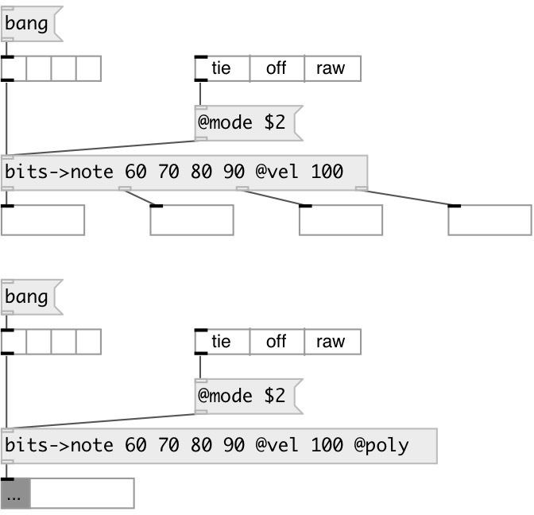

[index](index.html) :: [conv](category_conv.html)
---

# conv.bits2note

###### convert list of bits to note events

*available since version:* 0.9.2

---

## information
In default mode: output NOTE VEL pair to corresponding bit index outlet. If bit is
            on: velocity is @vel, otherwise 0
In @poly mode: output VOICE NOTE VEL triplet to first outlet

## arguments:

* **KEYS**
list of note keys 
__type:__ list 

## properties:

* **@poly** 
Get/set polyphonic mode. (for using with [clone] object) 
__type:__ flag 
__default:__ 0 

* **@mode** 
Get/set mode for repeated notes. If &#39;off&#39; - send note off before retriggering, if &#39;tie&#39;
- ignore repeated events, if &#39;raw&#39; - always send on/off events 
__type:__ symbol 
__enum:__ off, tie, raw 
__default:__ off 

* **@keys** 
Get/set list of mapped keys 
__type:__ list 

* **@vel** 
Get/set output velocity 
__type:__ float 
__range:__ 0..127 
__default:__ 90 

## inlets:

* input bit list 
__type:__ control 

## outlets:

* output
__type:__ control 

## keywords:

[conv](keywords/conv.html)
[bits](keywords/bits.html)
[note](keywords/note.html)
[poly](keywords/poly.html)

**Authors:** Serge Poltavsky

**License:** GPL3 or later

