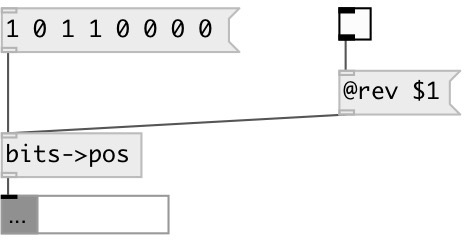

[index](index.html) :: [conv](category_conv.html)
---

# conv.bits2pos
**aliases:** [ceammc/bits-&gt;pos], [bits-&gt;pos]

###### convert list of bits to list of bit position

*available since version:* 0.9.2

---

## information
Note: byte default the least significant bit is the rightmost, this can be changed with @rev property

## properties:

* **@rev** 
Get/set reversed bit order 
_type:_ bool 
_default:_ 0 

## inlets:

* input bit list 
_type:_ control

## outlets:

* list of bit positions 
_type:_ control

## keywords:

[conv](keywords/conv.html)
[bits](keywords/bits.html)
[position](keywords/position.html)

**See also:**
[\[conv.bits2int\]](conv.bits2int.html)

**Authors:** Serge Poltavsky

**License:** GPL3 or later

