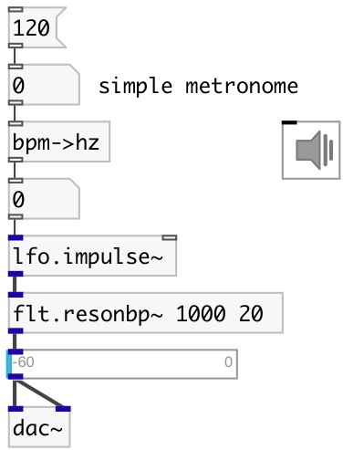

[index](index.html) :: [conv](category_conv.html)
---

# conv.bpm2hz
**aliases:** [ceammc/bpm-&gt;hz], [bpm-&gt;hz]

###### converts BPM to frequency in herz

*available since version:* 0.1

---

## information
Converts frequency from BPM (beats per minute) to herz. It&#39;s simple as /60, but more readable

## inlets:

* frequency in BPM 
_type:_ control

## outlets:

* frequency in herz 
_type:_ control

## keywords:

[conv](keywords/conv.html)
[time](keywords/time.html)

**See also:**
[\[conv.bpm2ms\]](conv.bpm2ms.html)

**Authors:** Serge Poltavsky

**License:** GPL3 or later

