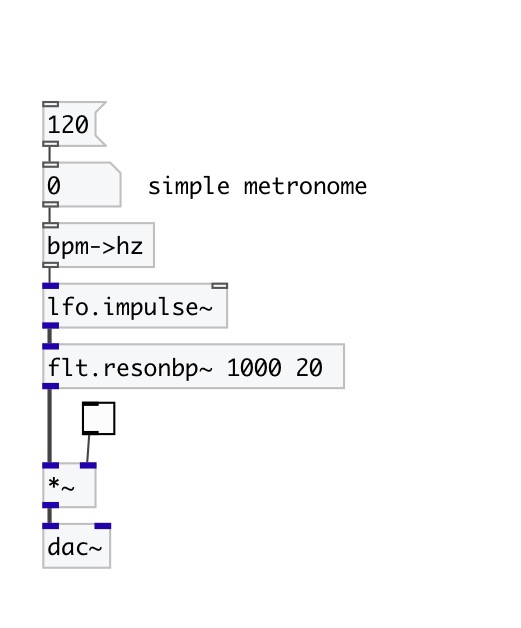

[< reference home](index.html)
---

# conv.bpm2hz

converts BPM to frequency in herz

---

Converts frequency from BPM (beats per minute) to herz. It is simple as /60, but
            more readable.
 

---

---
arguments:

---
properties:

---
see also: 

