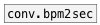

[< reference home](index.html)
---

# conv.bpm2ms


convert frequency in BPM to period in milliseconds

---

Converts frequency from BPM (beats per minute) to period in ms. It is simple as
            (60 / f) * 1000, but more readable.
<br>


---


```


        [F]   /* tempo */
        |
        [* 8] /* 32nds */
        |
[T]     [bpm->ms]
|       |.
[metro 80]
|
[next(
|
[list.walk 60 72 48 77 84 62 67 @fold]
|
[mtof]
|
[osc.pulse~]
|
| [T]
| |.
[*~]
|
[dac~]

            
```

---
arguments:


---
properties:


---
see also:<br>
[](conv.bpm2sec.html)
[](conv.bpm2hz.html)
