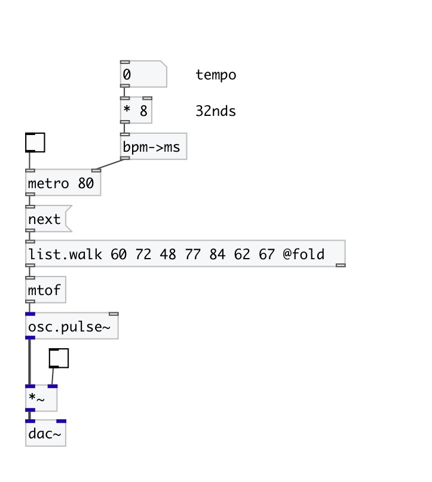

[< reference home](index.html)
---

# conv.bpm2ms

convert frequency in BPM to period in milliseconds

---

Converts frequency from BPM (beats per minute) to period in ms. It is simple as
            (60 / f) * 1000, but more readable.
 

---

---
arguments:

---
properties:

---
see also: 

