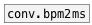
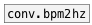

[< reference home](ceammc_lib.html)
---

# conv.bpm2sec


convert frequency in BPM to period in seconds

---

Convert frequency from BPM (beats per minute) to period in seconds. It&#39;s simple as
            60/f, but more readable.
<br>


---


```

```

---
arguments:


---
properties:


---
see also:<br>
[](conv.bpm2ms.html)
[](conv.bpm2hz.html)
