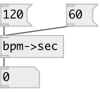

[index](index.html) :: [conv](category_conv.html)
---

# conv.bpm2sec

###### convert frequency in BPM to period in seconds

*available since version:* 0.1

---

## information
Convert frequency from BPM (beats per minute) to period in seconds. It&#39;s simple as
            60/f, but more readable.

## inlets:

* frequency in BPM 
_type:_ control

## outlets:

* period in seconds 
_type:_ control

## keywords:

[conv](keywords/conv.html)
[time](keywords/time.html)

**See also:**
[\[conv.bpm2ms\]](conv.bpm2ms.html)
[\[conv.bpm2hz\]](conv.bpm2hz.html)

**Authors:** Serge Poltavsky

**License:** GPL3 or later

