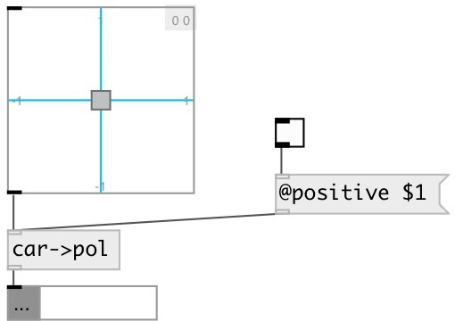

[index](index.html) :: [conv](category_conv.html)
---

# conv.car2pol

###### convert cartesian coords to polar

*available since version:* 0.8

---

## properties:

* **@positive** 
Get/set output in positive range. If true output is in [0..2π) range, otherwise output
range is [-π..+π] 
__type:__ int 
__enum:__ 0, 1 
__default:__ 0 

## inlets:

* x, y coord pair 
__type:__ control 

## outlets:

* radius and angle (in radians) pair
__type:__ control 

## keywords:

[conv](keywords/conv.html)
[polar](keywords/polar.html)
[cartesian](keywords/cartesian.html)

**See also:**
[\[conv.pol2car\]](conv.pol2car.html)

**Authors:** Serge Poltavsky

**License:** GPL3 or later

