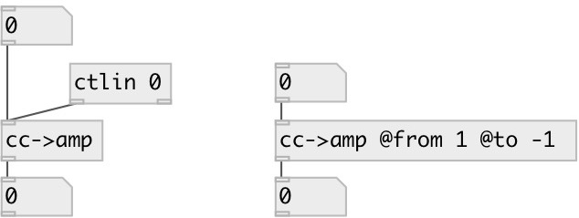

[index](index.html) :: [conv](category_conv.html)
---

# conv.cc2amp

###### convert from MIDI Control Change range

*available since version:* 0.3

---

## information
By default converts from [0..127] to [0..1]

## arguments:

* **FROM**
start value of output range 
_type:_ float 

* **TO**
end value of output range 
_type:_ float 

## properties:

* **@from** 
Get/set start value of output range 
_type:_ float 
_default:_ 0 

* **@to** 
Get/set end value of output range 
_type:_ float 
_default:_ 1 

## inlets:

* value in MIDI CC range [0..127] 
_type:_ control

## outlets:

* converted value 
_type:_ control

## keywords:

[conv](keywords/conv.html)
[cc](keywords/cc.html)
[amp](keywords/amp.html)

**See also:**
[\[lin-&gt;lin\]](lin-%3Elin.html)
[\[lin-&gt;curve\]](lin-%3Ecurve.html)

**Authors:** Serge Poltavsky

**License:** GPL3 or later

